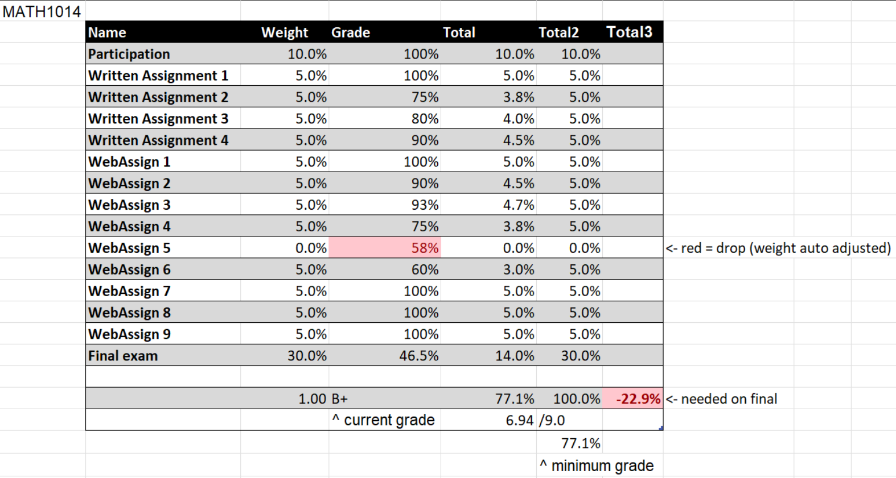
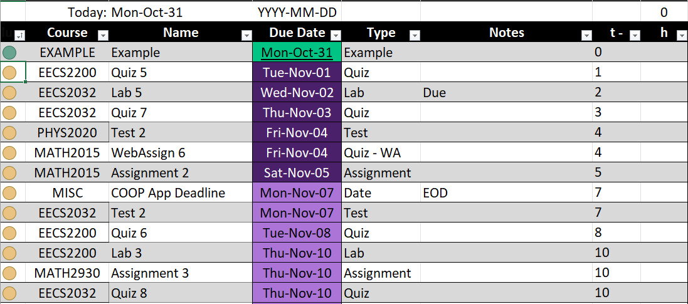
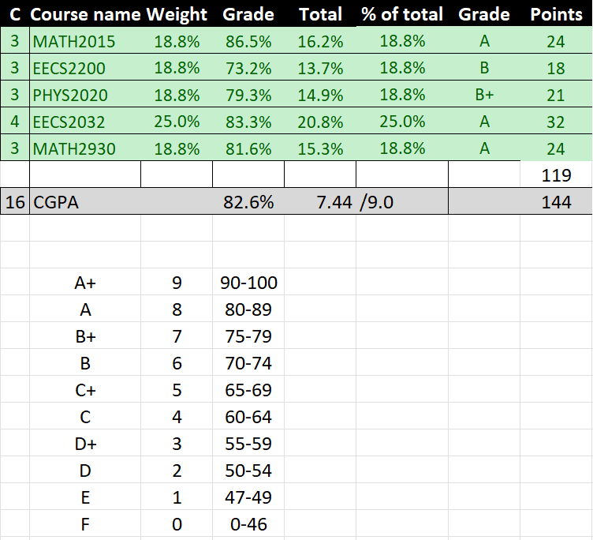
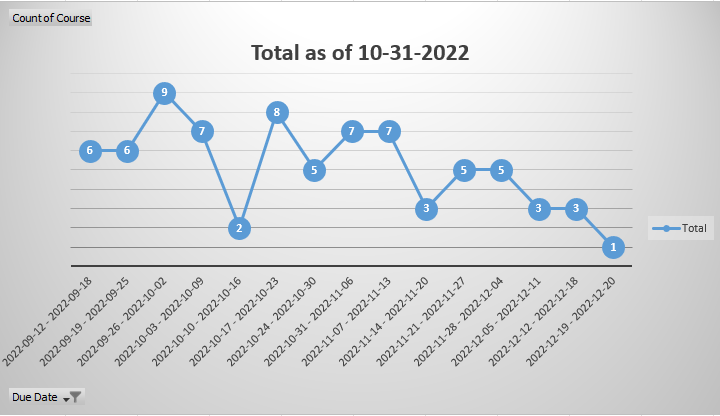

# Gradebook

This gradebook started off as something that I made at the start of my first year of university, I was trying to just keep myself organized. I found  myself adding more and more features and suddenly, its part of my daily routine to use it.

- Self taught Excel functions and conventions

## Features

- Track upcoming assessments
- Calculate current grade
- Find minimum grade (so far)
- Find overall GPA (9 GPA only for now)
- Find workload over time
- Colour coded based on due date
- Automatically find dropped assignments/quizzes

## Demo

A: 1=done, 0=pending, -1=not done/prio over deadline

B: Course code

C: Item Name

D: Due date

E: Type (Optoinal)

F: Notes (Optional)

G: # of days left

H: Number of hours per assignment (best used near end of semester

## The future

- Currently working on a sort of "work over time" graph, its not very accurate as it reads something like a midterm and a small assignment and a final as the same, but it was more of just letting myself know how much was left in the future weeks
- Id like to make this into a webapplication one day, I started teaching myself Flask in hopes of having a beta version out by end of 2022

[//]: #
